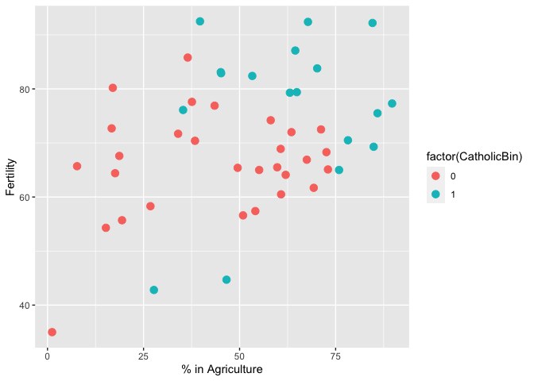
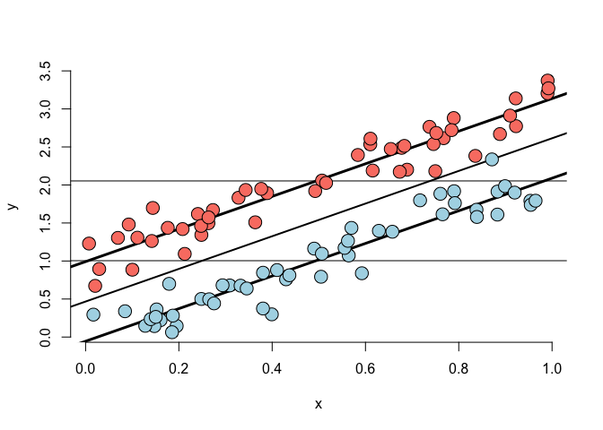

-   <a href="#module-7-multivariable-regression"
    id="toc-module-7-multivariable-regression">Module 7: Multivariable
    regression</a>
    -   <a href="#the-linear-model" id="toc-the-linear-model">The linear
        model</a>
    -   <a href="#interpretation-of-the-coeficients"
        id="toc-interpretation-of-the-coeficients">Interpretation of the
        coeficients</a>
        -   <a href="#fitted-values-residuals-and-residual-variation"
            id="toc-fitted-values-residuals-and-residual-variation">Fitted values,
            residuals and residual variation</a>
    -   <a href="#linear-models" id="toc-linear-models">Linear models</a>
-   <a href="#module-8-multivariable-regression-tips-and-tricks"
    id="toc-module-8-multivariable-regression-tips-and-tricks">Module 8:
    Multivariable regression tips and tricks</a>
    -   <a href="#data-set-for-discussion" id="toc-data-set-for-discussion">Data
        set for discussion</a>
        -   <a href="#example-interpretation"
            id="toc-example-interpretation">Example interpretation</a>
    -   <a href="#including-a-completely-unnecessary-variable-in-the-model"
        id="toc-including-a-completely-unnecessary-variable-in-the-model">Including
        a completely unnecessary variable in the model</a>
    -   <a href="#dummy-variables-are-smart"
        id="toc-dummy-variables-are-smart">Dummy variables are smart</a>
    -   <a href="#more-than-two-levels" id="toc-more-than-two-levels">More than
        two levels</a>
    -   <a href="#reordering-the-levels-releveling"
        id="toc-reordering-the-levels-releveling">Reordering the levels
        (releveling)</a>
    -   <a href="#summary" id="toc-summary">Summary</a>
    -   <a href="#other-caveats-on-the-data-used"
        id="toc-other-caveats-on-the-data-used">Other caveats on the data
        used</a>
    -   <a href="#analysis-of-covariance-ancova"
        id="toc-analysis-of-covariance-ancova">Analysis of covariance
        (ANCOVA)</a>
-   <a href="#module-9-adjustemnt" id="toc-module-9-adjustemnt">Module 9:
    Adjustemnt</a>
    -   <a href="#final-thoughts" id="toc-final-thoughts">Final thoughts</a>
-   <a href="#module-10-residuals-deiagnostics-variation"
    id="toc-module-10-residuals-deiagnostics-variation">Module 10:
    Residuals, deiagnostics &amp; variation</a>
    -   <a href="#the-linear-model-1" id="toc-the-linear-model-1">The linear
        model</a>
    -   <a href="#influential-high-leverage-outlying-points"
        id="toc-influential-high-leverage-outlying-points">Influential, high
        leverage &amp; outlying points</a>
    -   <a href="#influence-measures" id="toc-influence-measures">Influence
        measures</a>
    -   <a href="#case-1" id="toc-case-1">Case 1</a>
    -   <a href="#back-to-swiss-data" id="toc-back-to-swiss-data">Back to swiss
        data</a>
-   <a href="#module-10-model-selection"
    id="toc-module-10-model-selection">Module 10: Model selection</a>
    -   <a href="#general-rules" id="toc-general-rules">General rules</a>
    -   <a href="#variation-inflation" id="toc-variation-inflation">Variation
        inflation</a>
    -   <a href="#variation-inflation-factors"
        id="toc-variation-inflation-factors">Variation inflation factors</a>
        -   <a href="#example-swiss-data" id="toc-example-swiss-data">Example Swiss
            data</a>
    -   <a href="#residual-variance-estimation"
        id="toc-residual-variance-estimation">Residual variance estimation</a>
        -   <a href="#nesteed-model-testing" id="toc-nesteed-model-testing">Nesteed
            model testing</a>

# Module 7: Multivariable regression

The first natural extension for linear regression is to assume additive
effects, i.e. extending the regression line to a plane or a generalized
version of a plane.

-   If you were presented evidence of a relationship between breath mint
    usage (mints per day, *X*) and pulmonary function (measured in FEV),
    you would be skeptical.
    -   Likely, you would say “smokers tend to use more breath mints
        than non-smokers, smoking is related to a loss in pulmonary
        function. That is probably the culprit”.
    -   If asked what would convince you, you likely say “if non-smokers
        mint users had lower lung function than non-smoking non-breath
        mint users and smoking breath mint users had lower lung function
        than smoking non-breath mint users I would be more inclined to
        believe you”.
-   In other words, to even consider the result, one would have to
    demonstrate the result is holding while keeping smoking status
    fixed.

Multivariate regression is a sort of automated way to do that in a
linear fashion, looking at the relationship of a predictor and a
response, while having, at some level, accounted for other variables.

-   An insurance company is interested in how last year’s claims can
    predict a person’s time in the hospital this year.

    -   They want to use an enormous amount of data contained in claims
        the predict a single number. Simple linear regression is not
        equipped to handle more than one predictor.

-   How can one generalized single linear regression to incorporate lots
    of regressors for the purpose of prediction?

-   What are the consequences of adding lots of regressors?

    -   Surely there must be consequences to including variables into a
        model.
    -   Surely there must be consequences to omitting variables into a
        model.

## The linear model

The general linear model extends simple linear regression by adding
terms linearly into the model

$$
Y\_i 
= 
\beta\_1 X\_{1i} + \ldots + \beta\_p X\_{pi}
+
\epsilon\_i
=
\sum\_{j=1}^{p} \beta\_{p}X\_{ij}
+
\epsilon\_i
.
$$
Here *X*1*i* = 1 for all *i* in the data set, so that an
intercept is included.

Least squares (and hence ML estimates under Gassianity of errors)
minimizes
$$
\sum\_{i=1}^{n}
\left(
Y\_i
-
\sum\_{j=1}^{p} \beta\_{p}X\_{ij}
\right)^2
$$
The important linearity is the **linearity in coefficients**. Thus, a
model given by
$$
Y\_i 
= 
\beta\_1 X\_{1i}^2 + \ldots + \beta\_p X\_{pi}^2
+
\epsilon\_i
=
\sum\_{j=1}^{p} \beta\_{p}X\_{ij}^2
+
\epsilon\_i
.
$$
is still a linear model, in this case with squared elements of the
predictors.

For the case with two regressors,
*Y**i* = *β*0 + *β*1*X*1*i* + *β*2*X*2*i* + *ϵ**i*,
the estimates $\hat{\beta\_0}$, $\hat{\beta\_0}$ and $\hat{\beta\_0}$
are obtained as the minimizers of the criterion

the criterion to be minimized is
$$
J(\beta\_0, \beta\_1, \beta\_2) = \sum\_{i=1}^{n} \left( Y\_i - \beta\_0 - \beta\_1 X\_{1i} - \beta\_2 X\_{2i} \right)^2,
$$
i.e.
$$
\left( \hat{\beta\_0}, \hat{\beta\_1}, \hat{\beta\_2} \right)  = \underset{\left( \beta\_0, \beta\_1, \beta\_2  \right) }{\mathrm{argmin}} \\; J \left( \beta\_0, \beta\_1, \beta\_2 \right) 
$$
Setting the partial derivatives to zero leads to
$$
\begin{align}
\frac{\text{d} J(\beta\_0, \beta\_1, \beta\_2)}{\text{d} \beta\_0}
& 
=
0
\Leftrightarrow 
n \bar{Y} - n \beta\_0 - \beta\_1 n \bar{X\_{1}} - \beta\_2 n \bar{X\_{2}}
=
0
\\\\
\frac{\text{d} J(\beta\_0, \beta\_1, \beta\_2)}{\text{d} \beta\_1}
&
=
0
\Leftrightarrow
\sum\_{i=1}^{n} X\_{1i} Y\_i - n \beta\_0 \bar{X\_{1}} - \beta\_1 \sum\_{i=1}^{n} X\_{1i}^2 - \beta\_2 \sum\_{i=1}^{n} X\_{1i} X\_{2i}
=
0
\\\\
\frac{\text{d} J(\beta\_0, \beta\_1, \beta\_2)}{\text{d} \beta\_2}
&
=
0
\Leftrightarrow
\sum\_{i=1}^{n} X\_{2i} Y\_i - n \beta\_0 \bar{X\_{2}} - \beta\_1 \sum\_{i=1}^{n} X\_{2i} X\_{1i} - \beta\_2 \sum\_{i=1}^{n} X\_{2i}^2
=
0
\end{align}
$$
which, by subtracting the first line multiplied with $\bar{X\_1}$ from
the second line and by subtracting the first line multiplied with
$\bar{X\_2}$ from the third line leads to
$$
\begin{align}
q\_{X\_{1} Y}
- 
\beta\_1 \sigma\_{X\_{1}}^2
- 
\beta\_2 q\_{X\_{1}X\_{2}}
&
=
0
\\\\
q\_{X\_{2} Y}
- 
\beta\_1 q\_{X\_{1}X\_{2}}
- 
\beta\_2 \sigma\_{X\_{2}}^2
&
=
0
\end{align}
$$
with *q**U**V* denoting the sample covariance of *U* and *V*,
which gives the estimates
$$
\begin{align}
\beta\_0 
&
= 
\bar{Y} - \widehat{\beta}\_1 \bar{X\_{1}} - \widehat{\beta}\_2 \bar{X\_{2}}
\\\\
\widehat{\beta}\_1
&
=
\frac{
q\_{X\_{1} Y} \sigma\_{X\_{2}}^2
-
q\_{X\_{2} Y} q\_{X\_{1}X\_{2}} 
}
{
\sigma\_{X\_{1}}^2
\sigma\_{X\_{2}}^2 
-
q\_{X\_{1}X\_{2}}^2
}
,
\\\\
\widehat{\beta}\_2
&
=
\frac{
q\_{X\_{2} Y} \sigma\_{X\_{1}}^2
-
q\_{X\_{1} Y} q\_{X\_{1}X\_{2}} 
}
{
\sigma\_{X\_{1}}^2
\sigma\_{X\_{2}}^2 
-
q\_{X\_{1}X\_{2}}^2
}
,
\end{align}
$$
The estimates can be obtained via the **partialling out** interpretation
of linear regression i.e. by residual of *X*2 out of
*X*1, and *X*2 out of *Y* and then do regression
to the origin.

The coefficient for *X*1, i.e *β*1, is the
coefficient having removed *X*2, the other covariant, from
both the response and that first predictor, *X*1. Similarly,
the regression coefficient for *X*2 *β*2 is the
coefficent having removed *X*1 out of both the response *Y*
and out of the second predictor, *x*2.

This explains what multi-variable regression is doing. A coefficient
from a multi-variable regression is the coefficient where for all the
other variables their linear effect on that predictor and their response
has been removed.

In general, for more than one regressor, the derivation of the estimates
it is more easy using a matrix framework.

    n <- 100;

    x <- rnorm(n)
    x2 <- rnorm(n)
    x3 <- rnorm(n)
    y <- 1 + x + x2 + x3 + rnorm(n, sd = 0.1)
    ex <- resid(lm(x ~ x2 + x3))
    ey <- resid(lm(y ~ x2 + x3))
    coef(lm(ey ~ ex -1))

    ##        ex 
    ## 0.9750648

    sum(ey * ex) / sum(ex**2)

    ## [1] 0.9750648

    coef(lm(y ~ x + x2 + x3))

    ## (Intercept)           x          x2          x3 
    ##   0.9966514   0.9750648   0.9987877   0.9916793

## Interpretation of the coeficients

$$
\mathbb{E} \left\[ Y \mid X1 = x1, \ldots, X\_p = x\_p \right\]
=
\sum\_{j=1}^{p} x\_k \beta\_j
$$
$$
\mathbb{E} \left\[ Y \mid X1 = x1+1, \ldots, X\_p = x\_p \right\]
=
\left( x\_1+1 \right) \beta\_1
+
\sum\_{j=2}^{p} x\_k \beta\_j
$$
𝔼\[*Y*∣*X*1=*x*1+1,…,*X**p*=*x**p*\] − 𝔼\[*Y*∣*X*1=*x*1+1,…,*X**p*=*x**p*\] = *β*1
The interpretation of a multivariate regression coefficient is the
**expected change in the response per unit change in the regressor,
holding all the other regressors fixed**.

### Fitted values, residuals and residual variation

The simple linear regression quantities can b e extend to linear models:

-   Model:

$$ Y\_i 
= 
\sum\_{j = 1}^{p} X\_{ij}\beta{j} + \epsilon\_i, 
\quad 
\epsilon\_i 
\sim 
\text{Normal}\left( 0, \sigma^2 \right)
.
$$

-   Fitted response:

$$
\widehat{Y}\_i 
=
\sum\_{j = 1}^{p} 
X\_{ij} \widehat{\beta}\_{k}
.
$$

-   Residuals:

*ϵ̂**i* = *Y**i* − *Ŷ**i*.

-   Variance estimate:

$$
\widehat{\sigma}
=
\frac{1}{n-p}
\sum\_{i = 1}^{n}
\widehat{\epsilon}\_i^2
.
$$

-   To get predicted response at new values
    *x*1, …, *x**p*, simply plug the values in the
    linear model

$$
\sum\_{j = 1}^{p} x\_j \widehat{\beta}\_j
$$

-   The coefficients *β̂**j* have standard errors
    *σ̂**β̂**j*.

-   

$$
\frac{\widehat{\beta}\_j - \beta\_j}{\widehat{\sigma}\_{\widehat{\beta}\_j}}
\sim
t
$$

## Linear models

-   Linear models are the single most important applied statistical and
    machine learning technique, *by far*.

-   Some things one can accomplish with linear models:

    -   Decompose a signal into its harmonics.
    -   Flexibly fit complicated functions.
    -   Fit factor variables as predictors.
    -   Uncover comples multivare relationships with the response.
    -   Build accurate prediction models.

# Module 8: Multivariable regression tips and tricks

## Data set for discussion

Standardized fertility measure and socio-economic indicators for each of
47 French-speaking provinces of Switzerland at about 1888.

A data frame with 47 observations on 6 variables, each of which is in
percent, i.e., in \[0, 100\].

-   \[,1\] *Fertility* - a common standardized fertility measure
-   \[,2\] *Agriculture* - percentage of males involved in agriculture
    as occupation
-   \[,3\] *Examination* - percentage draftees receiving highest mark on
    army examination
-   \[,4\] *Education* - percentage education beyond primary school for
    draftees.
-   \[,5\] *Catholic* - percentage ‘catholic’ (as opposed to
    ‘protestant’).
-   \[,6\] *Infant.Mortality* - live births who live less than 1 year.

All variables but *Fertility* give proportions of the population.

    require(datasets)
    data(swiss)
    require(GGally)

    ## Loading required package: GGally

    ## Loading required package: ggplot2

    ## Registered S3 method overwritten by 'GGally':
    ##   method from   
    ##   +.gg   ggplot2

    require(ggplot2)

    g <- ggpairs(swiss, lower = list(continuous = 'smooth', parms = c(method = 'loess')))
    g

    summary(lm(Fertility~ ., data = swiss))$coefficients

    ##                    Estimate  Std. Error   t value     Pr(>|t|)
    ## (Intercept)      66.9151817 10.70603759  6.250229 1.906051e-07
    ## Agriculture      -0.1721140  0.07030392 -2.448142 1.872715e-02
    ## Examination      -0.2580082  0.25387820 -1.016268 3.154617e-01
    ## Education        -0.8709401  0.18302860 -4.758492 2.430605e-05
    ## Catholic          0.1041153  0.03525785  2.952969 5.190079e-03
    ## Infant.Mortality  1.0770481  0.38171965  2.821568 7.335715e-03

### Example interpretation

-   Agriculture is expressed in percentages (0-100)
-   Estimate is  − 0.1721
-   Our models estimates an expected 0.17 decrease in standardized
    fertility for ever 1% increase in percentage of males involved in
    agriculture in holding the remaining variables constant.
-   The *t*-test for *H*0 : *β*Agriculture = 0
    versus *H*0 : *β*Agriculture ≠ 0 is
    significant.

<!-- -->

    summary(lm(Fertility~ Agriculture, data = swiss))$coefficients

    ##               Estimate Std. Error   t value     Pr(>|t|)
    ## (Intercept) 60.3043752 4.25125562 14.185074 3.216304e-18
    ## Agriculture  0.1942017 0.07671176  2.531577 1.491720e-02

How can adjustment reverse the sign of an effect?

    n <- 100
    x2 <- 1:n
    x1 <- 0.01 * x2 + runif(n, -.1, .1)
    y <- -x1 + x2 + rnorm(n, sd = .01)

    summary(lm(y ~ x1))$coef

    ##               Estimate Std. Error     t value     Pr(>|t|)
    ## (Intercept)  0.1128145   1.174575  0.09604708 9.236793e-01
    ## x1          97.2777545   1.997490 48.69999849 1.755624e-70

    summary(lm(y ~ x1 + x2))$coef

    ##                 Estimate   Std. Error      t value      Pr(>|t|)
    ## (Intercept) -0.001265381 0.0020560262   -0.6154498  5.396990e-01
    ## x1          -1.033296134 0.0177308197  -58.2768394  2.664261e-77
    ## x2           1.000349339 0.0001768749 5655.6888121 1.882378e-269

    dat <- data.frame(y = y, 
                      x1 = x1, 
                      x2 = x2, 
                      ey = resid(lm(y ~ x2)), 
                      ex1 = resid(lm(x1 ~ x2)))

    library(ggplot2)
    g <- ggplot(dat, aes(y = y, x = x1, color = x2))
    g <- g + geom_point(color = 'grey50', size = 3) 
    g <- g + geom_smooth(method = lm, se = FALSE, color = 'black') 
    g <- g + geom_point(size = 2)
    g

    ## `geom_smooth()` using formula = 'y ~ x'

    g <- ggplot(dat, aes(y = ey, x = ex1, color = x2))
    g <- g + geom_point(color = 'grey50', size = 3) 
    g <- g + geom_smooth(method = lm, se = FALSE, color = 'black') 
    g <- g + geom_point(size = 2)
    g

    ## `geom_smooth()` using formula = 'y ~ x'

-   The sign reverses itself with the inclusion of Examination and
    Education.

-   The percent of males in the province working in agriculture is
    negatively related to educational attainment (correlation of
    -0.6395) and Education and Examination (correlation 0.6984) are
    obviously measuring similar things.

    -   Is the positive marginal an artifact for not having accounted
        for the Education level? (Education does have a stornger effect,
        by the way.)

-   At the minimum, anyone claiming that provinces that are more
    agricultural have higher fertility rates would immediately be open
    to criticism.

## Including a completely unnecessary variable in the model

Including an extra variable that is simply a (linear) combination of the
variables already included in the model

    z <- swiss$Agriculture + swiss$Education
    lm(Fertility ~ . + z, data = swiss)

    ## Warning in terms.formula(formula, data = data): 'varlist' has changed (from
    ## nvar=6) to new 7 after EncodeVars() -- should no longer happen!

    ## 
    ## Call:
    ## lm(formula = Fertility ~ . + z, data = swiss)
    ## 
    ## Coefficients:
    ##      (Intercept)       Agriculture       Examination         Education  
    ##          66.9152           -0.1721           -0.2580           -0.8709  
    ##         Catholic  Infant.Mortality                 z  
    ##           0.1041            1.0770                NA

## Dummy variables are smart

The linear regression models are very felxible. One example is the case
where a **factor** variable is considered as the regressor, leading to
**analysis of variance (ANOVA)**

-   Consider the linear model

*Y**i* = *β*0 + *X**i*1*β*1 + *ϵ**i*.

where each *X**i*1 is binary, so that it is
*X**i*1 = 1 if measurement *i* is in a group and
*X**i*1 = 0 otherwise (e.g. treated versus not treated in a
clinical trail)

-   Then:

    -   for the people in the group, for the people *i* exposed to the
        treatment *X**i* = 1

𝔼\[*Y**i*|*X**i*=1\] = *β*0 + *β*1.
\* for the people in the group, for the people *i* exposed to the
treatment *X**i* = 1

𝔼\[*Y**i*|*X**i*=0\] = *β*0.

-   The least squares fits work out to be:
    -   *β̂*0 + *β̂*1 - the mean for those in the
        group.
    -   *β̂*0 - the mean for those not in the group.
-   *β̂*1 is interpreted as the increase or decrease in the
    mean comparing those in the group to those not.

## More than two levels

-   Consider a multilevel factor level, e.g. three level factor
    modelling political party affiliation: Republican, Democrat,
    Independent).

-   The model is:
    *Y**i* = *β*0 + *X**i*1*β*1 + *X**i*2*β*2 + *ϵ**i*
    .

-   *X**i*1 is 1 for Republican and 0 otherwise.

-   *X**i*2 is 1 for Democrat and 0 otherwise.

-   Then:

    -   If *i* is Republican, i.e. *X**i*1 = 1 and
        *X**i*2 = 0,
        𝔼\[*Y**i*|*X*1*i*=1,*X*2*i*=0\] = *β*0 + *β*1.
    -   If *i* is Democrat, i.e. *X**i*1 = 0 and
        *X**i*2 = 1,
        𝔼\[*Y**i*|*X*1*i*=0,*X*2*i*=1\] = *β*0 + *β*2.
    -   If *i* is Independent, i.e. *X**i*1 = 0 and
        *X**i*2 = 1,
        𝔼\[*Y**i*|*X*1*i*=0,*X*2*i*=0\] = *β*0.

-   *β*1 compares Republican to Independents

-   *β*2 compares Democrats to Independents

-   *β*1 − *β*2 compares Republican to Democrats

-   Choice of reference category changes the interpretation.

<!-- -->

    require(datasets)
    data("InsectSprays")
    require(stats)
    require(ggplot2)

    g <- ggplot(data = InsectSprays,
                aes(y = count, x = spray, fill = spray))
    g <- g + geom_violin(color = 'black', size = 2)

    ## Warning: Using `size` aesthetic for lines was deprecated in ggplot2 3.4.0.
    ## ℹ Please use `linewidth` instead.

    g <- g + xlab('Type of spray') + ylab('Insect count')
    g

    summary(lm(count ~ spray, data = InsectSprays))$coef

    ##                Estimate Std. Error    t value     Pr(>|t|)
    ## (Intercept)  14.5000000   1.132156 12.8074279 1.470512e-19
    ## sprayB        0.8333333   1.601110  0.5204724 6.044761e-01
    ## sprayC      -12.4166667   1.601110 -7.7550382 7.266893e-11
    ## sprayD       -9.5833333   1.601110 -5.9854322 9.816910e-08
    ## sprayE      -11.0000000   1.601110 -6.8702352 2.753922e-09
    ## sprayF        2.1666667   1.601110  1.3532281 1.805998e-01

Hard coding the dummy variables

    summary(lm(count ~ 
                   I(1 * (spray == 'B')) + 
                   I(1 * (spray == 'C')) + 
                   I(1 * (spray == 'D')) + 
                   I(1 * (spray == 'E')) + 
                   I(1 * (spray == 'F')),
               data = InsectSprays))$coef

    ##                          Estimate Std. Error    t value     Pr(>|t|)
    ## (Intercept)            14.5000000   1.132156 12.8074279 1.470512e-19
    ## I(1 * (spray == "B"))   0.8333333   1.601110  0.5204724 6.044761e-01
    ## I(1 * (spray == "C")) -12.4166667   1.601110 -7.7550382 7.266893e-11
    ## I(1 * (spray == "D"))  -9.5833333   1.601110 -5.9854322 9.816910e-08
    ## I(1 * (spray == "E")) -11.0000000   1.601110 -6.8702352 2.753922e-09
    ## I(1 * (spray == "F"))   2.1666667   1.601110  1.3532281 1.805998e-01

    summary(lm(count ~ 
                   I(1 * (spray == 'B')) + 
                   I(1 * (spray == 'C')) + 
                   I(1 * (spray == 'D')) + 
                   I(1 * (spray == 'E')) + 
                   I(1 * (spray == 'F')) +
                   I(1 * (spray == 'A')),
               data = InsectSprays))

    ## 
    ## Call:
    ## lm(formula = count ~ I(1 * (spray == "B")) + I(1 * (spray == 
    ##     "C")) + I(1 * (spray == "D")) + I(1 * (spray == "E")) + I(1 * 
    ##     (spray == "F")) + I(1 * (spray == "A")), data = InsectSprays)
    ## 
    ## Residuals:
    ##    Min     1Q Median     3Q    Max 
    ## -8.333 -1.958 -0.500  1.667  9.333 
    ## 
    ## Coefficients: (1 not defined because of singularities)
    ##                       Estimate Std. Error t value Pr(>|t|)    
    ## (Intercept)            14.5000     1.1322  12.807  < 2e-16 ***
    ## I(1 * (spray == "B"))   0.8333     1.6011   0.520    0.604    
    ## I(1 * (spray == "C")) -12.4167     1.6011  -7.755 7.27e-11 ***
    ## I(1 * (spray == "D"))  -9.5833     1.6011  -5.985 9.82e-08 ***
    ## I(1 * (spray == "E")) -11.0000     1.6011  -6.870 2.75e-09 ***
    ## I(1 * (spray == "F"))   2.1667     1.6011   1.353    0.181    
    ## I(1 * (spray == "A"))       NA         NA      NA       NA    
    ## ---
    ## Signif. codes:  0 '***' 0.001 '**' 0.01 '*' 0.05 '.' 0.1 ' ' 1
    ## 
    ## Residual standard error: 3.922 on 66 degrees of freedom
    ## Multiple R-squared:  0.7244, Adjusted R-squared:  0.7036 
    ## F-statistic:  34.7 on 5 and 66 DF,  p-value: < 2.2e-16

Removing the intercept

    summary(lm(count ~ spray - 1 , data = InsectSprays))$coef

    ##         Estimate Std. Error   t value     Pr(>|t|)
    ## sprayA 14.500000   1.132156 12.807428 1.470512e-19
    ## sprayB 15.333333   1.132156 13.543487 1.001994e-20
    ## sprayC  2.083333   1.132156  1.840148 7.024334e-02
    ## sprayD  4.916667   1.132156  4.342749 4.953047e-05
    ## sprayE  3.500000   1.132156  3.091448 2.916794e-03
    ## sprayF 16.666667   1.132156 14.721181 1.573471e-22

    library(dplyr)

    ## 
    ## Attaching package: 'dplyr'

    ## The following objects are masked from 'package:stats':
    ## 
    ##     filter, lag

    ## The following objects are masked from 'package:base':
    ## 
    ##     intersect, setdiff, setequal, union

    summarise(group_by(InsectSprays, spray), mn = mean(count))

    ## # A tibble: 6 × 2
    ##   spray    mn
    ##   <fct> <dbl>
    ## 1 A     14.5 
    ## 2 B     15.3 
    ## 3 C      2.08
    ## 4 D      4.92
    ## 5 E      3.5 
    ## 6 F     16.7

## Reordering the levels (releveling)

    spray2 <- relevel(InsectSprays$spray, 'C')
    summary(lm(count ~ spray2, data = InsectSprays))$coef

    ##              Estimate Std. Error  t value     Pr(>|t|)
    ## (Intercept)  2.083333   1.132156 1.840148 7.024334e-02
    ## spray2A     12.416667   1.601110 7.755038 7.266893e-11
    ## spray2B     13.250000   1.601110 8.275511 8.509776e-12
    ## spray2D      2.833333   1.601110 1.769606 8.141205e-02
    ## spray2E      1.416667   1.601110 0.884803 3.794750e-01
    ## spray2F     14.583333   1.601110 9.108266 2.794343e-13

## Summary

-   If we treat Spray as a factor, `R` includes an intercept and omits
    the alphabetically first level of the factor.

    -   All *t*-tests are for comparisons of Sprays versus Spray A.
    -   Empirical mean for A is the intercept.
    -   Other group means are the ITC plus their coefficient

-   If we omit an intercept, then it includes terms for all levels of

    -   Group means are the coefficients
    -   Tests are tests of whether the groups are different than zero.

-   If we want comparisons between Spray B and C, use `relevel`.

## Other caveats on the data used

-   Counts are bounded from below by 0, violates the assumption of
    Normally distributed data.

-   Variaces does not appear to be constant.

-   Perhaps taking logs of the counts would help.

-   Poissong GLM’s for fitting count data.

## Analysis of covariance (ANCOVA)

    library(datasets)
    data(swiss)
    head(swiss)

    ##              Fertility Agriculture Examination Education Catholic
    ## Courtelary        80.2        17.0          15        12     9.96
    ## Delemont          83.1        45.1           6         9    84.84
    ## Franches-Mnt      92.5        39.7           5         5    93.40
    ## Moutier           85.8        36.5          12         7    33.77
    ## Neuveville        76.9        43.5          17        15     5.16
    ## Porrentruy        76.1        35.3           9         7    90.57
    ##              Infant.Mortality
    ## Courtelary               22.2
    ## Delemont                 22.2
    ## Franches-Mnt             20.2
    ## Moutier                  20.3
    ## Neuveville               20.6
    ## Porrentruy               26.6

    hist(swiss$Catholic)

Create a binary variable

    library(dplyr)
    swiss <- mutate(swiss, CatholicBin = 1 *(Catholic > 50))
    head(swiss)

    ##              Fertility Agriculture Examination Education Catholic
    ## Courtelary        80.2        17.0          15        12     9.96
    ## Delemont          83.1        45.1           6         9    84.84
    ## Franches-Mnt      92.5        39.7           5         5    93.40
    ## Moutier           85.8        36.5          12         7    33.77
    ## Neuveville        76.9        43.5          17        15     5.16
    ## Porrentruy        76.1        35.3           9         7    90.57
    ##              Infant.Mortality CatholicBin
    ## Courtelary               22.2           0
    ## Delemont                 22.2           1
    ## Franches-Mnt             20.2           1
    ## Moutier                  20.3           0
    ## Neuveville               20.6           0
    ## Porrentruy               26.6           1

    g <- ggplot(swiss, 
                aes(x = Agriculture, 
                    y = Fertility, 
                    color = factor(CatholicBin)))
    g <- g + geom_point(size = 3)
    g <- g + xlab('% in Agriculture') + ylab('Fertility')
    g

The data:
$$
Y = \text{Fertility},
\\;
X\_1 = \text{Agriculture}, 
\\;
X\_2 = 
\begin{cases}
1, \text{&gt; 50% Catholic}
\\\\
0, \text{otherwise}
\end{cases}
$$

Model 1, disregarding the region religion entirely:
𝔼\[*Y*∣*X*1,*X*2\] = *β*0 + *β*1*X*1

Model 2, accounting for the region religion:
𝔼\[*Y*∣*X*1,*X*2\] = *β*0 + *β*1*X*1 + *β*2*X*2
which writes, depending on the variable corresponding to the region’s
religion:
$$
\mathbb{E} \left\[ Y \mid X\_1, X\_2 = 0 \right\]
=
\beta\_0 + \beta\_1 X\_{1}
\\\\
\mathbb{E} \left\[ Y \mid X\_1, X\_2 = 1 \right\]
=
\beta\_0 + \beta\_2 + \beta\_1 X\_{2}
$$
So fitting the Model 2, i.e. the model with variables *X*1
and *X*2 but no interaction, means fitting **two** models
with the same slope as the Model 1 (*β*1), but different
intercepts (*β*0 and *β*0 + *β*2)

Model 3, accounting for the region religion:
𝔼\[*Y*∣*X*1,*X*2\] = *β*0 + *β*1*X*1 + *β*2*X*2 + *β*3*X*1*X*2

which writes, depending on the variable corresponding to the region’s
religion:
$$
\mathbb{E} \left\[ Y \mid X\_1, X\_2 = 0 \right\]
=
\beta\_0 + \beta\_1 X\_{1}
\\\\
\mathbb{E} \left\[ Y \mid X\_1, X\_2 = 1 \right\]
=
\beta\_0 + \beta\_2 + (\beta\_1 + \beta\_3) X\_{2}
$$
So fitting the Model 2, i.e. the model with variables *X*1
and *X*2 with interaction, means fitting **two** models with
different intercepts (*β*1 and
*β*0 + *β*2) and different slopes (*β*1
and *β*1 + *β*3)

    fit = lm(Fertility ~ Agriculture, data = swiss)
    g1 = g
    g1 = g1 + geom_abline(intercept = coef(fit)[1],
                          slope = coef(fit)[2],
                          size = 2)
    g1

    summary(fit)$coef

    ##               Estimate Std. Error   t value     Pr(>|t|)
    ## (Intercept) 60.3043752 4.25125562 14.185074 3.216304e-18
    ## Agriculture  0.1942017 0.07671176  2.531577 1.491720e-02

    fit = lm(Fertility ~ Agriculture + factor(CatholicBin),
              data = swiss)
    g1 = g
    g1 = g1 + geom_abline(intercept = coef(fit)[1],
                          slope = coef(fit)[2],
                          size = 2)
    g1 = g1 + geom_abline(intercept = coef(fit)[1] + coef(fit)[3],
                          slope = coef(fit)[2],
                          size = 2)
    g1

    summary(fit)$coef

    ##                        Estimate Std. Error   t value     Pr(>|t|)
    ## (Intercept)          60.8322366  4.1058630 14.815944 1.032493e-18
    ## Agriculture           0.1241776  0.0810977  1.531210 1.328763e-01
    ## factor(CatholicBin)1  7.8843292  3.7483622  2.103406 4.118221e-02

    fit = lm(Fertility ~ Agriculture * factor(CatholicBin),
              data = swiss)
    g1 = g
    g1 = g1 + geom_abline(intercept = coef(fit)[1],
                          slope = coef(fit)[2],
                          size = 2)
    g1 = g1 + geom_abline(intercept = coef(fit)[1] + coef(fit)[3],
                          slope = coef(fit)[2] + coef(fit)[4],
                          size = 2)
    g1

    summary(fit)$coef

    ##                                     Estimate  Std. Error    t value
    ## (Intercept)                      62.04993019  4.78915566 12.9563402
    ## Agriculture                       0.09611572  0.09881204  0.9727127
    ## factor(CatholicBin)1              2.85770359 10.62644275  0.2689238
    ## Agriculture:factor(CatholicBin)1  0.08913512  0.17610660  0.5061430
    ##                                      Pr(>|t|)
    ## (Intercept)                      1.919379e-16
    ## Agriculture                      3.361364e-01
    ## factor(CatholicBin)1             7.892745e-01
    ## Agriculture:factor(CatholicBin)1 6.153416e-01

# Module 9: Adjustemnt

-   Adjustment is the idea of putting regressors into a linear model to
    investigate the role of a third variable on the relationship between
    another two, since it is often the case that a third variable can
    distort (confound) the relationship between two others.

-   **Example**: consider the lung cancer rates and breath mint usage,
    analysing the *forced expiratory volume* (a measure of lung
    function) and *breath mint usage*. A statistically significant
    regression relationship might not lead to the conclusion that breath
    mint usage is causing shortness of breath.

    -   First off, even if the association is sound, you don’t know that
        it’s causal.
    -   Secondly, the likely culprit is smoking habits, since smoking
        rates are likely related to both breath mint usage rates and
        lung function.

To check the fact that the result is not just variability in smoking
habit, the conclusion has to hold up among non-smokers and smokers
analyzed separately.

This is the idea of adding a regression variable into a model as
adjustment. The coefficient of interest is interpreted as the effect of
the predictor on the response, **holding the adjustment variable
constant**.

    n <- 100
    t <- rep(c(0, 1), c(n/2, n/2))
    x <- c(runif(n/2), runif(n/2))

    beta0 <- 0; beta1 <- 2; tau <- 1; sigma <- .2;
    y <- beta0 + beta1 * x + tau * t + rnorm(n, sd = sigma)

    plot(x, y, type = 'n', frame = FALSE)

    abline(lm(y ~ x), lwd = 2)
    abline(h = mean(y[1: (n/2)], lwd = 3))
    abline(h = mean(y[(n/2+1): n], lwd = 3))

    fit <- lm(y ~ x + t)
    abline(coef(fit)[1], 
           coef(fit)[2], 
           lwd = 3)
    abline(coef(fit)[1] + coef(fit)[3],  
           coef(fit)[2],
           lwd = 3)
    points(x[1:(n/2)], y[1:(n/2)], pch = 21, col = 'black', bg = 'lightblue', cex = 2)
    points(x[(n/2+1):n], y[(n/2+1):n], pch = 21, col = 'black', bg = 'salmon', cex = 2)

Some things to note in this simulation

-   The *X* variable is unrelated to group status.
-   The *X* variable is related to *Y*, but the intercept depends on
    group status.
-   The group variable is related to *Y*:
    -   The relationship between group status and *Y* is constant
        depending on *X*.
    -   The relationship between group status and *Y* disregarding *X*
        is about the same as holding *X* constant.

<!-- -->

    n <- 100
    t <- rep(c(0, 1), c(n/2, n/2))
    x <- c(runif(n/2,0,1), runif(n/2, 1.5, 2.5))

    beta0 <- 0; beta1 <- 2; tau <- 1; sigma <- .2;
    y <- beta0 + beta1 * x + tau * t + rnorm(n, sd = sigma)

    plot(x, y, type = 'n', frame = FALSE)

    abline(lm(y ~ x), lwd = 2)
    abline(h = mean(y[1: (n/2)], lwd = 3))
    abline(h = mean(y[(n/2+1): n], lwd = 3))

    fit <- lm(y ~ x + t)
    abline(coef(fit)[1], 
           coef(fit)[2], 
           lwd = 3)
    abline(coef(fit)[1] + coef(fit)[3],  
           coef(fit)[2],
           lwd = 3)
    points(x[1:(n/2)], y[1:(n/2)], pch = 21, col = 'black', bg = 'lightblue', cex = 2)
    points(x[(n/2+1):n], y[(n/2+1):n], pch = 21, col = 'black', bg = 'salmon', cex = 2)

Some things to note in this simulation

-   The horizontal lines show the marginal difference between the
    treated group (red) and the control group (blue).

-   Fitting the model accounting for the treatment-control variable, the
    change in the intercepts is much smaller.

-   This is a case where we observe from a massive treatment effect and
    an almost zero effect when accounting for x.

-   For this particular data set, if we would know that the *x* value is
    one or smaller, we would know that the group the data belong to and
    if we would know that the *x* value is 1.5 or higher, we would know
    that the data belong to the treated group. In this case, the
    knowledge of *x* gives us perfect knowledge of which treatment was
    received. This concept is known as the **propensity score**, showing
    that this is the exact opposite of what would happen if the data
    would have been randomized in which case it would be impossible to
    know the treatment applied based on the *x* level, because the *x*
    levels were all mixed up, with some of the high *x* levels assigned
    to the treated and some of the high *x* levels assigned to the
    control.

Discussion \* The *X* variable is highly related to group status. \* The
*X* variable is related to *Y*, the intercept doesn’t depend on the
group variable. \* The *X* variable remains related to *Y* holding group
status constant. \* The group variable is marginally related to *Y*
disregarding *X*. \* The model would estimate no adjusted effect due to
group. \* There isn’t any data to nform the relationship between group
and *Y*. \* The conclusion is entirely based on the model.

    n <- 100
    t <- rep(c(0, 1), c(n/2, n/2))
    x <- c(runif(n/2, 0, 1.1), runif(n/2, .9, 2))

    beta01 <- -.3; beta02 <- -1.8; 
    beta1 <- 1; 
    tau <- 1; sigma <- .1;

    y <- c(beta01 + beta1 * x[1:(n/2)] + tau * t[1:(n/2)] + rnorm(n/2, sd = sigma), beta02 + beta1 * x[(n/2+1):n] + tau * t[(n/2+1):n] + rnorm(n/2, sd = sigma))

    plot(x, y, type = 'n', frame = FALSE)

    abline(lm(y ~ x), lwd = 2)
    abline(h = mean(y[1: (n/2)], lwd = 3))
    abline(h = mean(y[(n/2+1): n], lwd = 3))

    fit <- lm(y ~ x + t)
    abline(coef(fit)[1], 
           coef(fit)[2], 
           lwd = 3)
    abline(coef(fit)[1] + coef(fit)[3],  
           coef(fit)[2],
           lwd = 3)
    points(x[1:(n/2)], y[1:(n/2)], pch = 21, col = 'black', bg = 'lightblue', cex = 2)
    points(x[(n/2+1):n], y[(n/2+1):n], pch = 21, col = 'black', bg = 'salmon', cex = 2)

Discussion \* Marginal association has red red group higher than blue.
\* Adjusted relationship has blue group higher than red \* Group status
related to *X* \* There is some direct evidence for comparing red and
blue holding *X* fixed.

## Final thoughts

-   Modeling multivariate relationships is difficult.
-   Play around with simulations to see how the inclusion or exclusion
    of another variable can change analysis.
-   The results of these analyses deal with the impact of variables on
    associations.
-   Ascertaining mechanism or cause are difficult subjects to be added
    on top of difficulty in understanding multivariate associations.

# Module 10: Residuals, deiagnostics & variation

## The linear model

-   Specified as

$$
Y\_i 
= 
\sum\_{j = 1}^{p}
X\_{ij} \beta\_{j}
+
\epsilon\_{i},
\quad
i = 1, \ldots, n.
$$
\* The noise is assumed to be normal

$$
\epsilon\_i 
\stackrel{\text{i.i.d}}{\sim}
\text{Normal}
\left(\epsilon \mid 0, \sigma^2 \right)
$$

-   The residuals are defined as the difference between the *Y* and the
    estimation *Ŷ*

$$
\widehat{\epsilon}\_{i}
=
Y\_i - \widehat{Y}\_i
=
Y\_i - \sum\_{j = 1}^{p} X\_{ij} \widehat{\beta}\_{j}
.
$$
\* The estimate of the residual variance *σ̂*2 is

$$
\widehat{\sigma}^2 
=
\frac{\sum\_{i=1}^{n}\widehat{\epsilon}\_i}{n-p}
,\quad
\mathbb{E} \left\[ \widehat{\sigma}^2 \right\] = \sigma^2
.
$$

    data(swiss)
    par(mfrow = c(2,2))
    fit <- lm(Fertility ~ . , data = swiss)
    plot(fit)

## Influential, high leverage & outlying points

    n = 100
    u <- rnorm(n, 0, 1)
    x <- c(u, mean(u), 5)
    N <- length(x)
    sigma = 0.2
    epsilon <- rnorm(N, 0, sigma)
    beta0 = 0
    beta1 = 1
    y <- beta0 + beta1 * x + epsilon
    x <- c(x, 0, 5)
    y <- c(y, 5, 0)

    plot(x, y, type = 'n', frame = FALSE)
    abline(beta0, beta1, lwd=2)
    points(x[1:n], y[1:n], pch = 21, col = 'black', bg = 'lightblue', cex = 2)
    points(x[(n+1):(n+4)], y[(n+1):(n+4)], pch = 21, col = 'black', bg = 'salmon', cex = 2)

The plot shows a clear linear relationship between the predictor and the
response for most of the data.

-   The lower left hand one,in the middle of the cloud of data it
    doesn’t have much **influence** or **leverage**.

-   The upper right hand one, has a significant influence, being far
    from the center of mass. In this case, however, it is close to the
    regression line, hence it doesn’t have a significant **influence**,
    i.e. the point “chose” not to exert the leverage.

-   The lower right hand point has a significant **leverage** and a
    significant **influence**.

-   The upper left hand point does not have a significant **leverage**
    but has a significant **influence**.

Calling a point an outlier is something vague.

Outliers can conform to the regression relationship (i.e. being
marginally oulying in X or Y but not oulying given the regression
relationship)

## Influence measures

In `R`, the influence measures can be done using `influence.measures`.
The measures inclued

-   `rstandard` - standardized residuals, residuals divided by their
    standard deviations.

-   `rstudent` - standardized residuals, residuals divided by their
    standard deviation where the *i*th data point was deleted in the
    calculation of the standard error, hence the standardized residual
    follows a *t* distribution.

-   `hatvalues` - measures of leverage.

-   `dffits` - change in the predicted response when the *i*th is
    omitted, measure of influence

-   `dfbetas` - change in individual coefficeints when the *i*th is
    omitted, measure of influence

-   `cooks.distance` - overall change in the coefficients when

-   `resid` - returns the ordinary residuals

## Case 1

    n = 100
    x <- c(10, rnorm(n))
    y <- c(10, rnorm(n))

    plot(x, y, frame = FALSE, cex = 2, pch = 21, bg = 'lightblue', col = 'black')
    points(x[1], y[1], cex = 2, pch = 21, bg = 'salmon', col = 'black')

    abline(lm(y[2:n+1] ~ x[2:n+1]), 
           lwd=2, 
           col = 'lightblue')

    abline(lm(y ~ x), 
           lwd=2, 
           col = 'salmon')

There’s a strong regression relationship by fitting a linear model to
the data due to the existence of the outlier point (red line). Otherwise
the correlation would be estimated to be zero (blue line).

    fit <- lm(y~x)
    round(dfbetas(fit)[1:10,2],3)

    ##      1      2      3      4      5      6      7      8      9     10 
    ##  6.178 -0.057  0.043 -0.005 -0.035  0.034 -0.039  0.002 -0.060 -0.039

    round(hatvalues(fit)[1:10],3)

    ##     1     2     3     4     5     6     7     8     9    10 
    ## 0.497 0.017 0.013 0.010 0.024 0.012 0.015 0.010 0.021 0.012

    n = 100
    x <- c(10, rnorm(n))
    y <- beta0 + beta1 * x + rnorm(n+1, 0, 0.2)

    plot(x, y, frame = FALSE, cex = 2, pch = 21, bg = 'lightblue', col = 'black')
    points(x[1], y[1], cex = 2, pch = 21, bg = 'salmon', col = 'black')

    abline(lm(y[2:n+1] ~ x[2:n+1]), 
           lwd=2, 
           col = 'lightblue')

    abline(lm(y ~ x), 
           lwd=2, 
           col = 'salmon')

    fit <- lm(y~x)
    round(dfbetas(fit)[1:10,2],3)

    ##      1      2      3      4      5      6      7      8      9     10 
    ##  0.967  0.020 -0.009  0.159 -0.024 -0.049 -0.061 -0.069 -0.348  0.055

    round(hatvalues(fit)[1:10],3)

    ##     1     2     3     4     5     6     7     8     9    10 
    ## 0.481 0.010 0.012 0.049 0.010 0.014 0.011 0.011 0.020 0.012

## Back to swiss data

    data(swiss)
    par(mfrow = c(2,2))
    fit <- lm(Fertility ~ . , data = swiss)
    plot(fit)

# Module 10: Model selection

In this lecture a challenging question is addressed: **How do we chose
what variables to include in a regression model?**.

No single easy answer exists and the most reasonable answer would be
**It depends.**. These concepts bleed into ideas of machine learning,
which is largely focused on high dimensional variable selection and
weighting. In the following lectures we cover some of the basics and,
most importantly, the consequences of over and under fitting a model.

**Prediction** has a different set of criteria, it is less concerned
with interpretability so we’re far more tolerant for complex models,
lots of interactions and automated search algorithms and rules to come
up with the best prediction with respect to a specific loss function.

In **modeling**, the interest lies in parsimonious, interpretable
representations to enhance our understanding of the phenomena under
study.

There are nearly uncountable ways that a model can be wrong. Here we’ll
focus on variable inclusion and exclusion.

The Rumslfed triplet: *There are known knows. These are things we know
that we know. There are known unknowns. That is to say, there are things
that we know we don’t know. But there are also unknown unknowns. There
are things we don’t know we don’t know*

-   **Known knows** - Regressors that we know we should check to include
    in the model and have.
-   **Known unknows** - Regressors that we would like to include in the
    model, but don’t have.
-   **Unknown unknows** - Regressors that we don’t even know about that
    we should have included in the model.

## General rules

-   Omitting variables results in bias in the coeficients of interest -
    unless their regressors are uncorrelated with the omitted ones.

    -   This is why we randomize treatments, if attempts to uncorrelate
        our treatment indicator with variables that we don’t have to put
        in the model.

-   Including variables we shouldn’t have increases standard errors of
    the regression variables.

    -   Actually, inlcuding any new variables increases (actual, not
        estimated) standard errors of other regressors. So we don’t want
        to idly throw variables into the model.

-   *R*2 increases monotonically as more regressors are
    included.

-   The SSE decreases monotonically as more regressors are included.

## Variation inflation

The consequence of **excluding important aggressors**, results in
**bias**.

The consequence of **including unimportant reggressors**, results in
**variation inflation**.

This is showed in the next simulation, in the ideal setting, where the
three regressors are not correlated, leading to very small variance
inflation.

    n <- 100
    nosim <- 1000

    x1 <- rnorm(n)
    x2 <- rnorm(n)
    x3 <- rnorm(n)

    betas <- sapply(1:nosim, function(i){
        y <- x1 + rnorm(n, sd = 0.3)
        c(coef(lm(y ~ x1))[2],
          coef(lm(y ~ x1 + x2))[2],
          coef(lm(y ~ x1 + x2 + x3))[2])    
    })
    round(apply(betas, 1, sd), 5)

    ##      x1      x1      x1 
    ## 0.03147 0.03147 0.03151

In the next simulation the setting where the regressors are correlated
is considered. This leads to a significant variance inflation (inflated
5 times when all three regressors are included).

    n <- 100
    nosim <- 1000

    x1 <- rnorm(n)
    x2 <- x1/sqrt(2) + rnorm(n) / sqrt(2)
    x3 <- x1 * 0.95 + rnorm(n) * sqrt(1 - 0.95^2)

    betas <- sapply(1:nosim, function(i){
        y <- x1 + rnorm(n, sd = 0.3)
        c(coef(lm(y ~ x1))[2],
          coef(lm(y ~ x1 + x2))[2],
          coef(lm(y ~ x1 + x2 + x3))[2])    
    })
    round(apply(betas, 1, sd), 5)

    ##      x1      x1      x1 
    ## 0.03245 0.04718 0.10013

There’s no free launch: **If we omit variables that are important, we
get bias, if we include variables that are unnecessary, we inflate
standard errors**.

## Variation inflation factors

-   Notice variance inflation was much worse when we included a variable
    that was highly related to *X*1.

-   We don’t know *σ*, so we can only estimate the increase in the
    actual standard error of the coefficients for including a regressor.

-   However, *σ* drops out of the relative standard errors. If one
    sequentially adds variables, one can check the variance (or sd)
    inflation for including each one.

-   When the other regressors are actually orthogonal to the regressor
    of interest, then there is no variance inflation.

-   The variance inflation factor (VIF) is the increase in the variance
    for the *i*th regressor compared to the ideal setting where it is
    orthogonal to the other regressors.

    -   The square of the VIF is the increase in the sd.

-   Remember, variance inflation is only part of the picture. We want to
    include certain variables if they dramatically inflate our variance.

### Example Swiss data

    data(swiss)
    fit1 <- lm(Fertility ~ . , data = swiss)
    library(car)

    ## Loading required package: carData

    ## 
    ## Attaching package: 'car'

    ## The following object is masked from 'package:dplyr':
    ## 
    ##     recode

    vif(fit)

    ##      Agriculture      Examination        Education         Catholic 
    ##         2.284129         3.675420         2.774943         1.937160 
    ## Infant.Mortality 
    ##         1.107542

    sqrt(vif(fit))

    ##      Agriculture      Examination        Education         Catholic 
    ##         1.511334         1.917138         1.665816         1.391819 
    ## Infant.Mortality 
    ##         1.052398

## Residual variance estimation

Assuming that model is linear with additive errors with finite variance
we can mathematically describe the impact of omitting necessary
variables or including unnecessary ones.

-   **If we underfit the midel, the variance estimate is biased**,
    because we’ve attributed to variation effects that are actually
    explained by the missing covariants.

-   **If we correctly fit or overfit the model**, including all
    dencessary covariantes and/or unnecessary covariantes **the variance
    estimate is unbiased**. However, the variance of the variance is
    larger if we include unnecessary variables.

-   Principal components or factor models on covariates are often
    uselful for reducing complex covariate spaces.

-   If the models of interest are nested and without lots of parameters
    differentiating them, it’s fairly uncontroversial to use nested
    liklelihood ratio tests.

### Nesteed model testing

    fit1 <- lm(Fertility ~ Agriculture, data = swiss)
    fit3 <- lm(Fertility ~ Agriculture + Examination + Education, data = swiss)
    fit5 <- lm(Fertility ~ Agriculture + Examination + Education + Catholic + Infant.Mortality, data = swiss)
    anova(fit1, fit3, fit5)

    ## Analysis of Variance Table
    ## 
    ## Model 1: Fertility ~ Agriculture
    ## Model 2: Fertility ~ Agriculture + Examination + Education
    ## Model 3: Fertility ~ Agriculture + Examination + Education + Catholic + 
    ##     Infant.Mortality
    ##   Res.Df    RSS Df Sum of Sq      F    Pr(>F)    
    ## 1     45 6283.1                                  
    ## 2     43 3180.9  2    3102.2 30.211 8.638e-09 ***
    ## 3     41 2105.0  2    1075.9 10.477 0.0002111 ***
    ## ---
    ## Signif. codes:  0 '***' 0.001 '**' 0.01 '*' 0.05 '.' 0.1 ' ' 1
