-   <a href="#module-11-glms" id="toc-module-11-glms">Module 11: GLMs</a>
    -   <a href="#linear-models" id="toc-linear-models">Linear models</a>
    -   <a href="#generalized-linear-models"
        id="toc-generalized-linear-models">Generalized linear models</a>
        -   <a href="#example" id="toc-example">Example</a>
-   <a href="#module-12-logistic-regression"
    id="toc-module-12-logistic-regression">Module 12: Logistic
    Regression</a>
    -   <a href="#key-ideas" id="toc-key-ideas">Key ideas</a>
    -   <a href="#linear-regression" id="toc-linear-regression">Linear
        regression</a>
    -   <a href="#odds" id="toc-odds">Odds</a>
    -   <a href="#linear-vs.-logistic-regression"
        id="toc-linear-vs.-logistic-regression">Linear vs. logistic
        regression</a>
    -   <a href="#interpreting-logistic-regression"
        id="toc-interpreting-logistic-regression">Interpreting Logistic
        Regression</a>
    -   <a href="#odds-1" id="toc-odds-1">Odds</a>
    -   <a href="#odds-rations-and-confidence-intervals"
        id="toc-odds-rations-and-confidence-intervals">Odds rations and
        confidence intervals</a>
-   <a href="#module-13-poisson-regression"
    id="toc-module-13-poisson-regression">Module 13: Poisson Regression</a>
    -   <a href="#key-ideas-1" id="toc-key-ideas-1">Key ideas</a>
    -   <a href="#example-1" id="toc-example-1">Example</a>
        -   <a href="#linear-regression-1" id="toc-linear-regression-1">Linear
            regression</a>
        -   <a href="#log-linear-regression" id="toc-log-linear-regression">Log
            linear regression</a>
        -   <a href="#linear-vs.-poisson-regression"
            id="toc-linear-vs.-poisson-regression">Linear vs. Poisson regression</a>
    -   <a href="#multiplicative-differences"
        id="toc-multiplicative-differences">Multiplicative differences</a>
    -   <a href="#mean-variance-relationship"
        id="toc-mean-variance-relationship">Mean-variance relationship?</a>
    -   <a href="#confidence-intervals" id="toc-confidence-intervals">Confidence
        intervals</a>
    -   <a href="#rates" id="toc-rates">Rates</a>
-   <a href="#module-14-hodgepodge" id="toc-module-14-hodgepodge">Module 14:
    Hodgepodge</a>
    -   <a href="#fitting-functions-using-linear-models"
        id="toc-fitting-functions-using-linear-models">Fitting functions using
        linear models</a>
    -   <a href="#notes" id="toc-notes">Notes</a>
    -   <a href="#harmonices-using-linear-models"
        id="toc-harmonices-using-linear-models">Harmonices using linear
        models</a>

# Module 11: GLMs

The three most famous cases of GLMs are: \* linear models, \* binomial
and binary regression \* Poisson regression.

## Linear models

-   Linear models are the most useful applied statistical technique.
    However, they are not without their limitations.

-   The assumption of an additive response model is not justified if the
    response is discrete or strictly positive.

-   Transformation are often hard to interpret.

-   Particularly interpretable transformations, like the logarithm, are
    not applicable for negative or zero values.

## Generalized linear models

-   The generalized linear models (GLMs) is a family of models that
    includes linear models.

-   GLMs were introduced in 1972 paper by Belder and Wedderburn

-   The GLMs involves three components:

    -   An **exponential family** model for the response.

    -   A systematic component via a linear predictor.

    -   A **link function** that connects the means of the response to
        the linear predictor.

### Example

-   Assume that
    *Y**i* ∼ Normal(*μ**i*,*σ*2)

(The normal distribution is an exponential family distribution).

-   Define the linear predictor to be
    $$
    \eta\_i 
    =
    \sum\_{j=1}^{p}
    X\_{ij} 
    \beta\_{j}
    $$

-   The link function as *g*, so that

*g*(*μ*) = *η*
\* For linear models, *g*(*μ*) = *μ* so that
*μ**i* = *ν**i*.

#### Example: Logistic regression

Assume that *Y**i* ∼ Bernoulli(*μ**i*) so that
𝔼(*Y**i*) = *μ**i*, where
0 ≤ *μ**i* ≤ 1.

The linear predictor is
$$
\eta\_i 
=
\sum\_{j=1}^{p}
X\_{ij} 
\beta\_{j}
$$
The link function is
$g(\mu) = \ln \left( \frac{\mu}{1 - \mu} \right) = \eta$. This link
function *g* is the (natural) log odds, refered to as the **logit**
function.

The mean *μ* is expressed via the linear predictor *η* using the
**logistic** function.

$$
g(\mu)
=
\ln \left( \frac{\mu}{1 - \mu} \right) 
= 
\eta
\Rightarrow
\mu
=
\frac{\exp{(\eta})}{1+\exp{(\eta)}}
$$

#### Example: Poisson regression

Assume that *Y**i* ∼ Poisson(*μ**i*) so that
𝔼(*Y**i*) = *μ**i*, where 0 ≤ *μ**i*.

The linear predictor is
$$
\eta\_i 
=
\sum\_{j=1}^{p}
X\_{ij} 
\beta\_{j}
$$
The link function is *g*(*μ*) = ln (*μ*) = *η*. This link function *g*
is the (natural) log.

The mean *μ* expressed via the linear predictor *η* using the
**logistic** function.

The mean *μ* is expressed via the linear predictor *η* using the
**logistic** function.

*g*(*μ*) = ln (*μ*) = *η* ⇒ *μ* = exp (*η*)

In each case, the only way in which the likelihood depends on the data
is through

$$
\sum\_{i=1}^{n}
y\_i \eta\_i
=
\sum\_{i=1}^{n}
y\_i 
\sum\_{j=1}^{p}
X\_{ij} 
\beta\_{j}
=
\sum\_{j=1}^{p}
\beta\_{j}
\sum\_{i=1}^{n}
X\_{ij} 
y\_{i}
$$

#### About variances

For the linear model, 𝕍\[*Y**i*\] = *σ*2 **is
constant**

For the Bernoulli case,
𝕍\[*Y**i*\] = *μ**i*(1−*μ**i*) - the
variance depends on the observation, unkile the linear models case where
the variance is constant. Similiarly, for Poisson case,
𝕍\[*Y**i*\] = *μ**i* the variance depends on the
observation.

#### Odds and ends

-   The normal equations have to be solved iteratively. Resulting in
    *β̂**k* and, if included, *ϕ̂*

-   Predicted linear predictior repsonses can be obtained as
    $\widehat{\eta} = \sum\_{j=1}^{p} X\_j \beta\_{j}$

-   The interpretation of the coefficients is the same as in the linear
    model case, the change in the expected response per unit change in
    the regressors, holding all the other regressors constant, this
    interpretation being done on the scale of the linear predictor.
    *β**k* = *g*(𝔼\[*X**j*=*x**j*+1,*X*−*j*=*x*−*j*\]) − *g*(𝔼\[*X**j*=*x**j*,*X*−*j*=*x*−*j*\])

# Module 12: Logistic Regression

## Key ideas

-   Frequently we care about outcomes that have two values:

    -   Alive/Dead
    -   Win/Loss
    -   Success/Failure

-   Called binary, Bernoulli or 0/1 outcomes

-   Collection of exchangeable binary outcomes for the same covariate
    leads to binomial outcomes.

<!-- -->

    df <- read.csv('./data/ravensData.csv')
    head(df)

    ##   X ravenWinNum ravenWin ravenScore opponentScore
    ## 1 1           1        W         24             9
    ## 2 2           1        W         38            35
    ## 3 3           1        W         28            13
    ## 4 4           1        W         34            31
    ## 5 5           1        W         44            13
    ## 6 6           0        L         23            24

## Linear regression

RW*i* = *β*0 + *β*1RS*i* + *ϵ**i*
\* RW*i* - 1 if a Ravens win, 0 if not. \* RS*i* -
number of points Ravens scored. \* *β*0 - probability of a
Ravens win if they score 0 points. \* *β*1 - increase in
probability of a Ravens win for each additional point. \*
*ϵ**i* - residual variation.

## Odds

-   Binary outcome 0/1

RW*i*

-   Probability (0,1)
    Pr(RW*i*∣RS*i*,*β*0,*β*1)

-   Odds (0,∞)
    $$
    \frac{
    \text{Pr}
    \left( 
    \text{RW}\_i 
    \mid 
    \text{RS}\_i, 
    \beta\_0, 
    \beta\_1 
    \right)
    }
    {1-\text{Pr}
    \left( 
    \text{RW}\_i 
    \mid 
    \text{RS}\_i, 
    \beta\_0, 
    \beta\_1 
    \right)}
    $$

-   Log odds (0,∞)

$$
\ln
\left(
\frac{
\text{Pr}
\left( 
\text{RW}\_i 
\mid 
\text{RS}\_i, 
\beta\_0, 
\beta\_1 
\right)
}
{1-\text{Pr}
\left( 
\text{RW}\_i 
\mid 
\text{RS}\_i, 
\beta\_0, 
\beta\_1 
\right)}
\right)
$$

## Linear vs. logistic regression

-   Linear

RW*i* = *β*0 + *β*1RS*i* + *ϵ**i* ⇔ 𝔼\[RW*i*∣RS*i*,*β*0,*β*1\] = *β*0 + *β*1RS*i*
\* Logistic
$$
\text{Pr}
\left( 
\text{RW}\_i 
\mid 
\text{RS}\_i, 
\beta\_0, 
\beta\_1 
\right)
=
\frac{\exp{\left(\beta\_0 + \beta\_1 \text{RS}\_i\right)}}{1 + \exp{\left(\beta\_0 + \beta\_1 \text{RS}\_i\right)}}
\Leftrightarrow
\ln
\left(
\frac{
\text{Pr}
\left( 
\text{RW}\_i 
\mid 
\text{RS}\_i, 
\beta\_0, 
\beta\_1 
\right)
}
{1-\text{Pr}
\left( 
\text{RW}\_i 
\mid 
\text{RS}\_i, 
\beta\_0, 
\beta\_1 
\right)}
\right)
=
\beta\_0 + \beta\_1 \text{RS}\_i
$$

## Interpreting Logistic Regression

$$
\ln
\left(
\frac{
\text{Pr}
\left( 
\text{RW}\_i 
\mid 
\text{RS}\_i, 
\beta\_0, 
\beta\_1 
\right)
}
{1-\text{Pr}
\left( 
\text{RW}\_i 
\mid 
\text{RS}\_i, 
\beta\_0, 
\beta\_1 
\right)}
\right)
=
\beta\_0 + \beta\_1 \text{RS}\_i
$$
\* *β*0 - log odds of a ravens win if they score zero points.

-   *β*1 - log odds ratio of win probability of each point
    scored, compared to zero points.

-   exp (*β*1)) - odds ratio of win probability for each
    point scored.

## Odds

-   A game is played, where a coin is flipped with success probability
    *p*

-   If it comes heads, the win is *X*, if it comes tails the loss is *Y*

-   How should *X* and *Y* be set so the game is fair?

𝔼\[earnings\] = *X**p* − *Y*(1−*p*)
\* Fair game implies

$$
\frac{Y}{X} = \frac{p}{1-p}
$$
\* The odds can be said as “How much should you be willing to pay for a
*p* probability of winning a dollar?”

    * if $p > 0.5$ you have to pay more if you lose than you get if you win.
    * if $p < 0.5$ you have to pay less if you lose than you get if you win.

    x<-seq(-10, 10, length = 1000)
    par(mfrow = c(2,2))
    beta0 = -2; beta1 = -1
    plot(x, exp(beta0+beta1*x)/(1 + exp(beta0+beta1*x)),
         type = 'l', lwd = 3, frame = FALSE)

    beta0 = -2; beta1 = 0
    plot(x, exp(beta0+beta1*x)/(1 + exp(beta0+beta1*x)),
         type = 'l', lwd = 3, frame = FALSE)
    beta0 = -2; beta1 = 1
    plot(x, exp(beta0+beta1*x)/(1 + exp(beta0+beta1*x)),
         type = 'l', lwd = 3, frame = FALSE)
    beta0 = 0; beta1 = 2
    plot(x, exp(beta0+beta1*x)/(1 + exp(beta0+beta1*x)),
         type = 'l', lwd = 3, frame = FALSE)

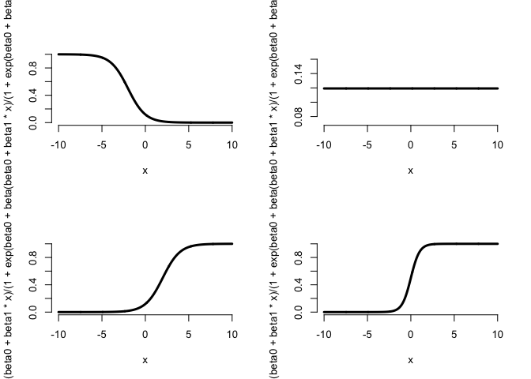

    logdf <- glm(df$ravenWinNum ~ df$ravenScore, family = 'binomial')
    summary(logdf)

    ## 
    ## Call:
    ## glm(formula = df$ravenWinNum ~ df$ravenScore, family = "binomial")
    ## 
    ## Deviance Residuals: 
    ##     Min       1Q   Median       3Q      Max  
    ## -1.7575  -1.0999   0.5305   0.8060   1.4947  
    ## 
    ## Coefficients:
    ##               Estimate Std. Error z value Pr(>|z|)
    ## (Intercept)   -1.68001    1.55412  -1.081     0.28
    ## df$ravenScore  0.10658    0.06674   1.597     0.11
    ## 
    ## (Dispersion parameter for binomial family taken to be 1)
    ## 
    ##     Null deviance: 24.435  on 19  degrees of freedom
    ## Residual deviance: 20.895  on 18  degrees of freedom
    ## AIC: 24.895
    ## 
    ## Number of Fisher Scoring iterations: 5

    plot(df$ravenScore, logdf$fitted, pch = 19, col = 'blue', xlab = 'Score', ylab = 'Prob Ravens Win')

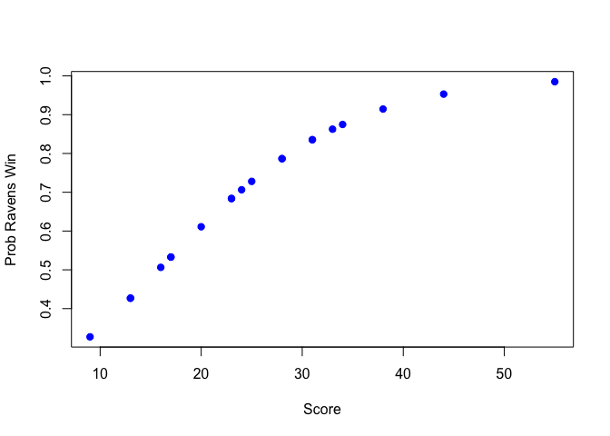

## Odds rations and confidence intervals

    exp(logdf$coeff)

    ##   (Intercept) df$ravenScore 
    ##     0.1863724     1.1124694

    exp(confint(logdf))

    ## Waiting for profiling to be done...

    ##                     2.5 %   97.5 %
    ## (Intercept)   0.005674966 3.106384
    ## df$ravenScore 0.996229662 1.303304

    anova(logdf, test = 'Chisq')

    ## Analysis of Deviance Table
    ## 
    ## Model: binomial, link: logit
    ## 
    ## Response: df$ravenWinNum
    ## 
    ## Terms added sequentially (first to last)
    ## 
    ## 
    ##               Df Deviance Resid. Df Resid. Dev Pr(>Chi)  
    ## NULL                             19     24.435           
    ## df$ravenScore  1   3.5398        18     20.895  0.05991 .
    ## ---
    ## Signif. codes:  0 '***' 0.001 '**' 0.01 '*' 0.05 '.' 0.1 ' ' 1

# Module 13: Poisson Regression

## Key ideas

-   Many data take the form of counts:

    -   Calls to a call center.
    -   Number of flue cases in an area.
    -   Number of cars that cross a bridge.

-   Data may also be in the form of rates:

    -   Percent of children passing a test.
    -   Perce of hits to a website from a country.

-   Linear regression with transformation is an option.

-   Poissing distribution is a useful model for counts and rates (here a
    rate is count per some monitoring time)

-   Some examples uses of the Poisson distribution

    -   Modeling web traffic hits.
    -   Incidence rates.
    -   Approximating binomial probabilities with small *p* and large
        *n*.
    -   Analyzing contingency table data.

-   The Poisson mass function

$$
X \sim \text{Poisson}\left(x \mid t\lambda \right)
, \quad
\text{Pr}\left( X = x \right)
=
\frac{(t\lambda)^x \exp{ \left( -t \lambda \right) }}{x!}, x = 0, 1, \ldots, 
$$

-   The mean of the Poisson is 𝔼\[*X*\] = *t**λ*, thus
    𝔼\[*X*/*t*\] = *λ*.

-   The variance of the Poisson is 𝕍\[*X*\] = *t**λ*

-   The Poisson tends to a normal as *t**λ* gets large.

<!-- -->

    par(mfrow = c(1,3))
    plot(0:10, dpois(0:10, lambda = 2), type = 'h', frame = FALSE)
    plot(0:20, dpois(0:20, lambda = 10), type = 'h', frame = FALSE)
    plot(0:200, dpois(0:200, lambda = 100), type = 'h', frame = FALSE)

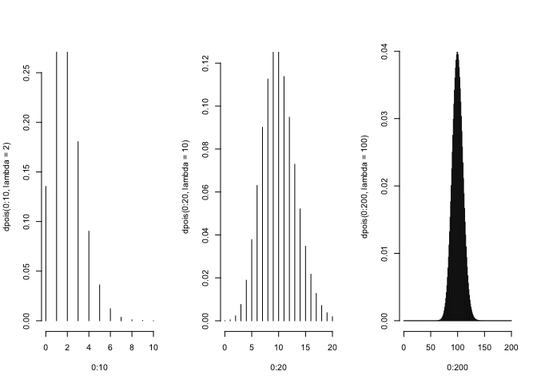

## Example

    df <- read.csv('./data/gaData.csv')
    df$julian <- julian(as.Date(df$date))
    head(df)

    ##         date visits simplystats julian
    ## 1 2011-01-01      0           0  14975
    ## 2 2011-01-02      0           0  14976
    ## 3 2011-01-03      0           0  14977
    ## 4 2011-01-04      0           0  14978
    ## 5 2011-01-05      0           0  14979
    ## 6 2011-01-06      0           0  14980

    plot(df$julian, df$visits, 
         pch = 19, col = 'darkgrey', 
         xlab = 'Julian', ylab = 'Visits')
    lm1 <- lm(df$visits ~ df$julian)
    abline(lm1, col = 'red', lwd = 3)

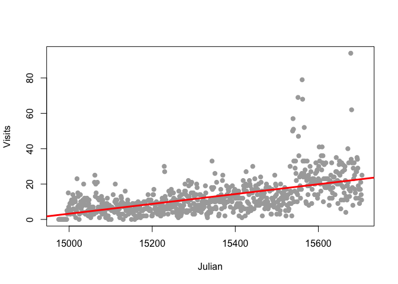

### Linear regression

NH*i* = *β*0 + *β*1JD*i* + *ϵ**i*
\* NH*i* - number of hits to the website \*
JD*i* - day of the year (Julian day) \* *β*0 -
number of hits on Julian day 0 \* *β*1 - increase in number
of hits per unit day \* *ϵ**i* - variation due to everything
we didn’t measure.

### Log linear regression

Taking the logarithm of the outcome has a specific interpretation

ln (NH*i*) = *β*0 + *β*1JD*i* + *ϵ**i*
\* NH*i* - number of hits to the website \*
JD*i* - day of the year (Julian day) \* *β*0 - log
number of hits on Julian day 0 \* *β*1 - increase in log
number of hits per unit day \* *ϵ**i* - variation due to
everything we didn’t measure.

### Linear vs. Poisson regression

-   Linear
    NH*i* = *β*0 + *β*1JD*i* + *ϵ**i* ⇔ 𝔼(NH*i*∣JD*i*,*β*0,*β*1) = *β*0 + *β*1JD*i*

-   Poisson / log-linear
    ln (𝔼\[NH*i*∣JD*i*,*β*0,*β*1\]) = *β*0 + *β*1JD*i* ⇔ 𝔼\[NH*i*∣JD*i*,*β*0,*β*1\] = exp (*β*0+*β*1JD*i*)

<!-- -->

    round(exp(coef(lm(I(log(df$visits+1)) ~ df$julian))),5)

    ## (Intercept)   df$julian 
    ##     0.00000     1.00231

## Multiplicative differences

𝔼\[NH*i*∣JD*i*,*β*0,*β*1\] = exp (*β*0+*β*1JD*i*) = exp (*β*0)exp (*β*1JD*i*)

If JD*i* is increased by one unit, $$ is multiplied by
exp (*β*1)

    plot(df$julian, df$visits, 
         pch = 19, col = 'darkgrey', 
         xlab = 'Julian', ylab = 'Visits')
    lm1 <- lm(df$visits ~ df$julian)
    glm1 <- glm(df$visits ~ df$julian, family = 'poisson')
    abline(lm1, col = 'red', lwd = 3)
    lines(df$julian, glm1$fitted, col = 'blue', lwd = 3)

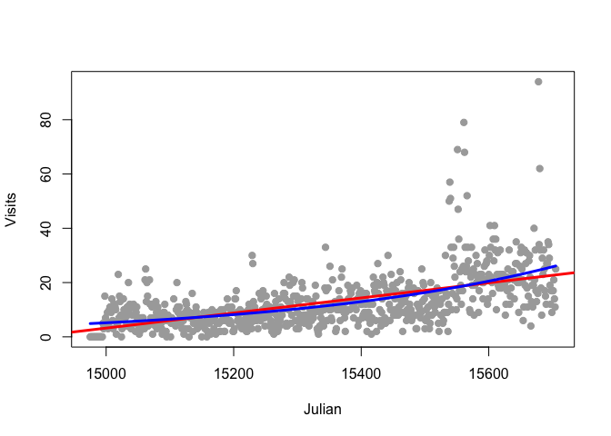

## Mean-variance relationship?

    plot(glm1$fitted, glm1$residuals, 
         pch = 19, col = 'grey',
         xlab = 'Fitted', ylab = 'Residuals')

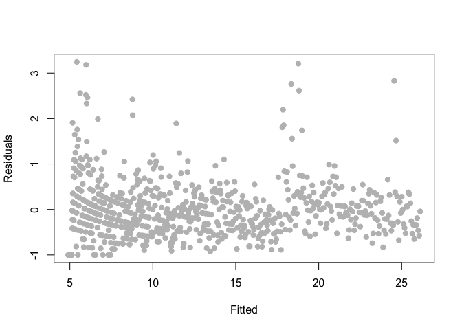

## Confidence intervals

    confint(glm1)

    ## Waiting for profiling to be done...

    ##                     2.5 %        97.5 %
    ## (Intercept) -34.346577587 -31.159715656
    ## df$julian     0.002190043   0.002396461

## Rates

𝔼\[NHSS*i*∣JD*i*,*β*0,*β*1\]/NH*i* = exp (*β*0+*β*1JD*i*)
ln (𝔼\[NHSS*i*∣JD*i*,*β*0,*β*1\]) − ln (NH*i*) = *β*0 + *β*1JD*i*
ln (𝔼\[NHSS*i*∣JD*i*,*β*0,*β*1\]) = ln (NH*i*) + *β*0 + *β*1JD*i*

    glm2 <- glm(df$simplystats ~ df$julian, 
                offset = log(df$visits + 1),
                family = 'poisson')
    plot(df$julian, glm2$fitted, 
         pch = 19, col = 'blue', 
         xlab = 'JulDateian', ylab = 'Fitted')
    points(df$julian, glm1$fitted, 
         pch = 19, col = 'red', 
         xlab = 'JulDateian', ylab = 'Fitted')

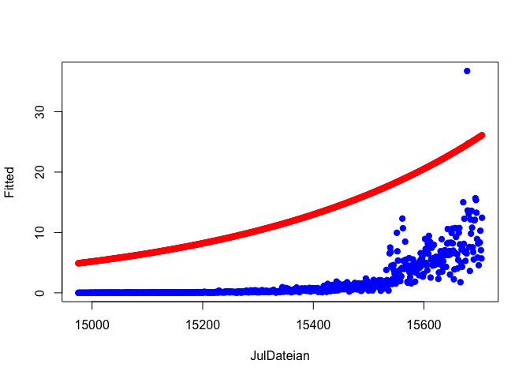

    glm2 <- glm(df$simplystats ~ df$julian, 
                offset = log(df$visits + 1),
                family = 'poisson')
    plot(df$julian, df$simplystats/(df$visits+1), 
         pch = 19, col = 'grey', 
         xlab = 'Date', ylab = 'Fitted Rates')
    points(df$julian, glm2$fitted/(df$visits+1), 
         pch = 19, col = 'blue', 
         xlab = 'JulDateian', ylab = 'Fitted')

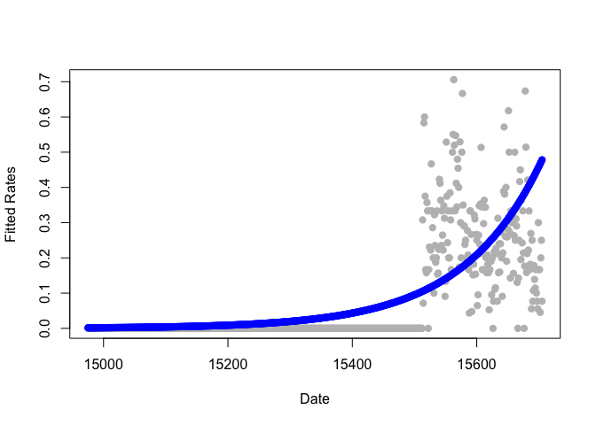

# Module 14: Hodgepodge

## Fitting functions using linear models

-   Consider a model

*Y**i* = *f*(*X**i*) + *ϵ*
\* How can we fit such a model using linear models (scatterplot
smoothing)

-   Consider the model:

$$
Y\_i 
= 
\beta\_0 
+ 
\beta\_1 X\_i 
+
\sum\_{j}^{d} 
\left( 
x\_i - \xi\_{j}
\right)\_{+}
\gamma\_{j}
+ 
\epsilon\_i
$$
where
$$
(a)\_{+} 
=
\begin{cases}
a, \\; a &gt; 0
\\\\
0, \\; \text{otherwise}
\end{cases}
$$
and *ξ*1 ≤ …*ξ**d* are known knots.

-   The mean function

$$
\beta\_0 
+ 
\beta\_1 X\_i 
+
\sum\_{j}^{d} 
\left( 
x\_i - \xi\_{j}
\right)\_{+}
\gamma\_{j}
$$
is continuous at the know points.

    n <- 500
    x <- seq(0, 4 * pi, length = n)
    y <- sin(x) + rnorm(n, sd = .3)

    knots <- seq(0, 8*pi, length = 20)

    splineTerms <- sapply(knots, function(knots) (x>knots) * (x - knots))

    xMat <- cbind(1, x, splineTerms)
    yhat <- predict(lm(y ~ xMat -1))
    plot(x, y, frame = FALSE, pch = 21, bg = 'lightblue', cex = 2)
    lines(x, yhat, col = 'salmon', lwd=2)

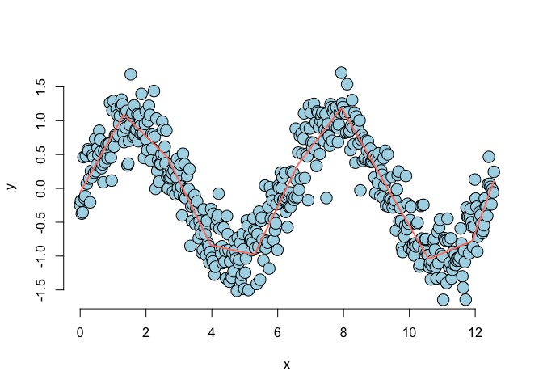

-   Adding squared terms makes it continuously differentiable at the
    knot points.

-   Adding cubic terms makes it twice continuously differentiable at the
    knot points.

$$
Y\_i 
= 
\beta\_0 
+ 
\beta\_1 X\_i 
+ 
\beta\_2 X\_i^2 
+
\sum\_{j}^{d} 
\left( 
x\_i - \xi\_{j}
\right)^2\_{+}
\gamma\_{j}
+ 
\epsilon\_i
$$

    n <- 500
    x <- seq(0, 4 * pi, length = n)
    y <- sin(x) + rnorm(n, sd = .3)

    knots <- seq(0, 8*pi, length = 20)

    splineTerms <- sapply(knots, function(knots) (x > knots) * (x - knots)^2)

    xMat <- cbind(1, x, x^2, splineTerms)
    yhat <- predict(lm(y ~ xMat -1))
    plot(x, y, frame = FALSE, pch = 21, bg = 'lightblue', cex = 2)
    lines(x, yhat, col = 'salmon', lwd=2)

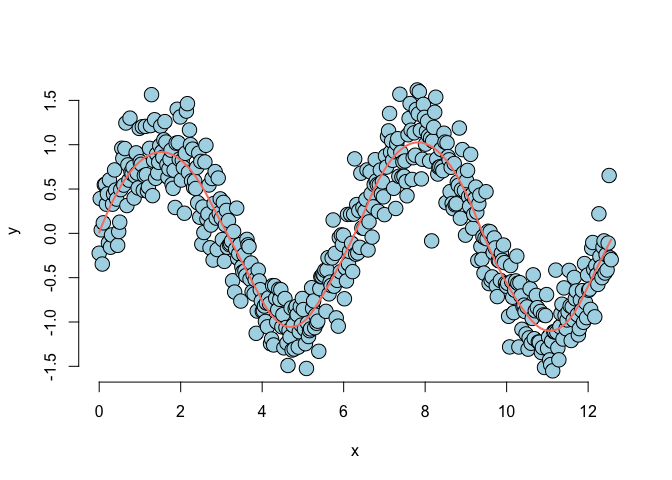

## Notes

-   The collection of regressors is called a basis.

-   Single know point terms can fit hockey stick like processes.

-   These bases can be used in GLMs as well.

-   An issue with these approaches is the large number of parameters
    introduced.

-   Requires some method of so called regularization.

## Harmonices using linear models

    notes4 <- c(261.63, 293.66, 329.63, 349.23, 392.00, 440.00, 493.88, 523.25)

    t <- seq(0, 2, by = 0.001)
    n <- length(n)

    c4 <- sin(2 * pi * notes4[1] * t)
    e4 <- sin(2 * pi * notes4[3] * t)
    g4 <- sin(2 * pi * notes4[5] * t)

    chord <- c4 + e4 + g4 + rnorm(n, 0, 0.3)

    Harmonic <- function(freq){
        sin(2 * pi * freq * t)
    }

    x <- sapply(notes4, Harmonic)

    fit <- lm(chord ~ x - 1)

    plot(notes4, fit$coefficients, type = 'l')

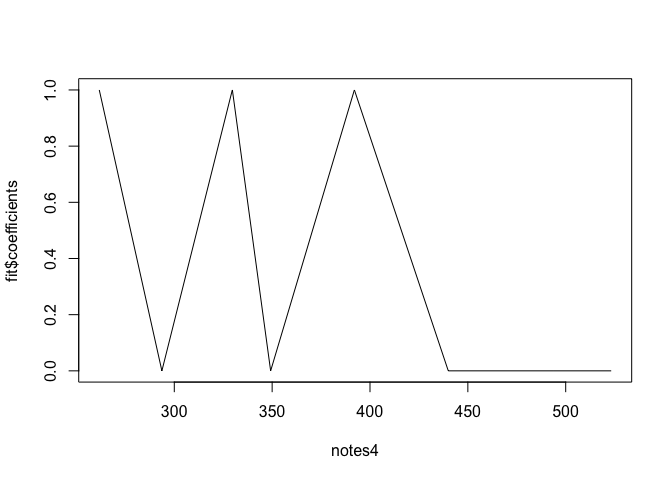

    a <- fft(chord)
    plot(Re(a)^2, type = 'l')

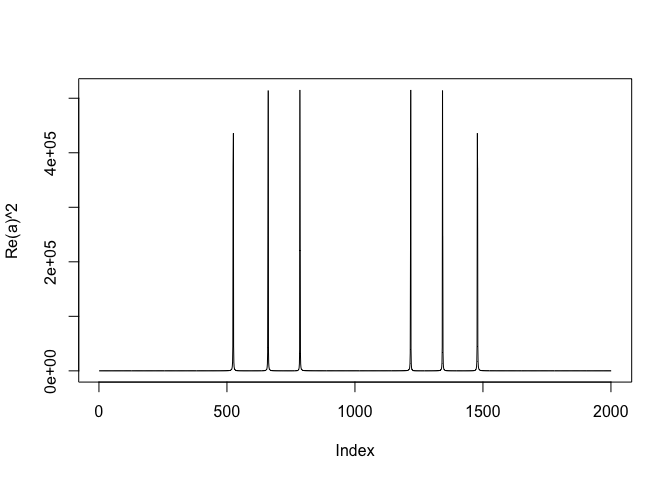
