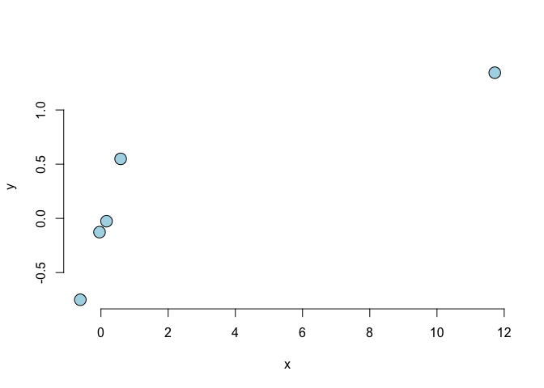

## Question 1

Consider the `mtcars` data set. Fit a model with mpg as the outcome that
includes number of cylinders as a factor variable and weight as
confounder. Give the adjusted estimate for the expected change in mpg
comparing 8 cylinders to 4.

## Answer 1

    data(mtcars)
    fit <- lm(mpg ~ as.factor(cyl) + wt, data = mtcars)
    fit$coef

    ##     (Intercept) as.factor(cyl)6 as.factor(cyl)8              wt 
    ##       33.990794       -4.255582       -6.070860       -3.205613

## Question 2

Consider the `mtcars` data set. Fit a model with mpg as the outcome that
includes number of cylinders as a factor variable and weight as a
possible confounding variable. Compare the effect of 8 versus 4
cylinders on mpg for the adjusted and unadjusted by weight models. Here,
adjusted means including the weight variable as a term in the regression
model and unadjusted means the model without weight included. What can
be said about the effect comparing 8 and 4 cylinders after looking at
models with and without weight included?.

## Answer 2

    data(mtcars)
    fit <- lm(mpg ~ as.factor(cyl) + wt, data = mtcars)
    summary(fit)$coef

    ##                  Estimate Std. Error   t value     Pr(>|t|)
    ## (Intercept)     33.990794  1.8877934 18.005569 6.257246e-17
    ## as.factor(cyl)6 -4.255582  1.3860728 -3.070244 4.717834e-03
    ## as.factor(cyl)8 -6.070860  1.6522878 -3.674214 9.991893e-04
    ## wt              -3.205613  0.7538957 -4.252065 2.130435e-04

    fit1 <- lm(mpg ~ as.factor(cyl), data = mtcars)
    summary(fit1)$coef

    ##                   Estimate Std. Error   t value     Pr(>|t|)
    ## (Intercept)      26.663636  0.9718008 27.437347 2.688358e-22
    ## as.factor(cyl)6  -6.920779  1.5583482 -4.441099 1.194696e-04
    ## as.factor(cyl)8 -11.563636  1.2986235 -8.904534 8.568209e-10

Holding weight constant, cylinder appears to have less of an impact on
mpg than if weight is disregarded.

## Question 3

Consider the `mtcars` data set. Fit a model with mpg as the outcome that
considers number of cylinders as a factor variable and weight as
confounder. Now fit a second model with mpg as the outcome model that
considers the interaction between number of cylinders (as a factor
variable) and weight. Give the P-value for the likelihood ratio test
comparing the two models and suggest a model using 0.05 as a type I
error rate significance benchmark.

## Answer 3

    data(mtcars)
    fit <- lm(mpg ~ as.factor(cyl) + wt, data = mtcars)
    summary(fit)$coef

    ##                  Estimate Std. Error   t value     Pr(>|t|)
    ## (Intercept)     33.990794  1.8877934 18.005569 6.257246e-17
    ## as.factor(cyl)6 -4.255582  1.3860728 -3.070244 4.717834e-03
    ## as.factor(cyl)8 -6.070860  1.6522878 -3.674214 9.991893e-04
    ## wt              -3.205613  0.7538957 -4.252065 2.130435e-04

    fit1 <- lm(mpg ~ as.factor(cyl)* wt, data = mtcars)
    summary(fit1)$coef

    ##                      Estimate Std. Error    t value     Pr(>|t|)
    ## (Intercept)         39.571196   3.193940 12.3894599 2.058359e-12
    ## as.factor(cyl)6    -11.162351   9.355346 -1.1931522 2.435843e-01
    ## as.factor(cyl)8    -15.703167   4.839464 -3.2448150 3.223216e-03
    ## wt                  -5.647025   1.359498 -4.1537586 3.127578e-04
    ## as.factor(cyl)6:wt   2.866919   3.117330  0.9196716 3.661987e-01
    ## as.factor(cyl)8:wt   3.454587   1.627261  2.1229458 4.344037e-02

    anova(fit, fit1)

    ## Analysis of Variance Table
    ## 
    ## Model 1: mpg ~ as.factor(cyl) + wt
    ## Model 2: mpg ~ as.factor(cyl) * wt
    ##   Res.Df    RSS Df Sum of Sq      F Pr(>F)
    ## 1     28 183.06                           
    ## 2     26 155.89  2     27.17 2.2658 0.1239

The *p*-value is larger than 0.05. Hence, we fail to reject, hence the
interaction term(s) may not be necessary.

## Question 4

Consider the `mtcars` data set. Fit a model with mpg as the outcome that
includes number of cylinders as a factor variable and weight inlcuded in
the model as

    lm(mpg ~ I(wt * 0.5) + factor(cyl), data = mtcars)

    ## 
    ## Call:
    ## lm(formula = mpg ~ I(wt * 0.5) + factor(cyl), data = mtcars)
    ## 
    ## Coefficients:
    ##  (Intercept)   I(wt * 0.5)  factor(cyl)6  factor(cyl)8  
    ##       33.991        -6.411        -4.256        -6.071

How is the `wt` coefficient interpreted?

## Answer 4

We are in the case where the slope is constant between the factor
models, i.e. the three (in this case) regression lines will have
different intercepts but the same slope, but nevertheless, for a
specific number of cylinders, the slope represents the estimated
expected change in the response variable. By taking the 0.5: **The
estimated expected change in MPG per one ton increase in weight for a
specific number of cylinders (4, 6, 8)..** (the `mtcars` has `wt`
expressed in 1000 lbs, since taking `I(wt * 0.5)` doubles the units this
leads to 2000 lbs, i.e. one tone.)

## Question 5

Consider the following data set

    x <- c(0.586, 0.166, -0.042, -0.614, 11.72)
    y <- c(0.549, -0.026, -0.127, -0.751, 1.344)

Give the hat diagonal for the most influential point

## Answer 5

    plot(x,y, type = 'n', frame = FALSE)
    points(x, y, pch = 21, col = 'black', 
           bg = 'lightblue', cex = 2)

    fit <- lm(y~x)
    round(hatvalues(fit),4)

    ##      1      2      3      4      5 
    ## 0.2287 0.2438 0.2525 0.2804 0.9946

## Question 6

Consider the following data set

    x <- c(0.586, 0.166, -0.042, -0.614, 11.72)
    y <- c(0.549, -0.026, -0.127, -0.751, 1.344)

Give the slope dfbeta for the point with the highest hat value.

## Answer 6

    plot(x,y, type = 'n', frame = FALSE)
    points(x, y, pch = 21, col = 'black', 
           bg = 'lightblue', cex = 2)

    fit <- lm(y~x)
    round(dfbetas(fit),4)

    ##   (Intercept)         x
    ## 1      1.0621   -0.3781
    ## 2      0.0675   -0.0286
    ## 3     -0.0174    0.0079
    ## 4     -1.2496    0.6725
    ## 5      0.2043 -133.8226

## Question 7

Consider a regression relationship between *Y* and *X* with and without
adjustment for a third variable *Z*. Which of the following is true
about comparing the regression coefficient between *Y* and *X* with and
without adjustment for *Z*.

## Answer 7

It is possible for the coefficient to reverse sign after adjustment. For
example, it can be strongly significant and positive before adjustment
and strongly significant and negative after adjustment. Simpson
(perceived) paradox.
