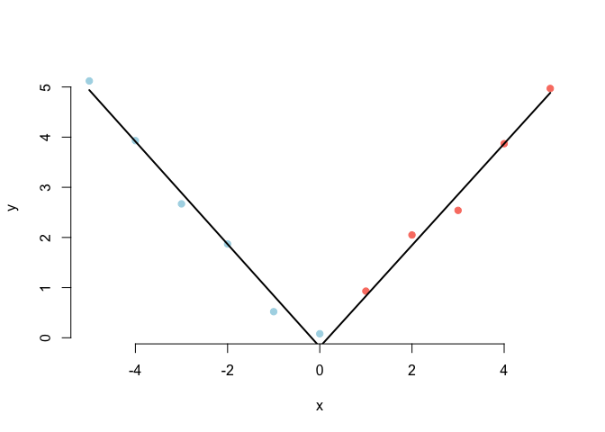

## Question 1

Consider the space shuttle data `?shuttle` in the `MASS` library.
Consider modeling the use of the autolander as the outcome (variable
name `use`). Fit a logistic regression model with autolander (variable
auto) use (labeled as “auto” 1) versus not (0) as predicted by wind sign
(variable wind). Give the estimated odds ratio for autolander use
comparing head winds, labeled as “head” in the variable headwind
(numerator) to tail winds (denominator).

## Answer 1

    library(MASS)
    data(shuttle)
    head(shuttle)

    ##   stability error sign wind   magn vis  use
    ## 1     xstab    LX   pp head  Light  no auto
    ## 2     xstab    LX   pp head Medium  no auto
    ## 3     xstab    LX   pp head Strong  no auto
    ## 4     xstab    LX   pp tail  Light  no auto
    ## 5     xstab    LX   pp tail Medium  no auto
    ## 6     xstab    LX   pp tail Strong  no auto

    names(shuttle)

    ## [1] "stability" "error"     "sign"      "wind"      "magn"      "vis"      
    ## [7] "use"

    logreg <- glm(use ~ wind, family = 'binomial', data = shuttle)
    logreg$coef

    ## (Intercept)    windtail 
    ## -0.25131443 -0.03181183

    exp(logreg$coef['windtail'])

    ##  windtail 
    ## 0.9686888

## Question 2

Consider the previous problem. Give the estimated odds ratio for
autolander use comparing head winds (numerator) to tail winds
(denominator) adjusting for wind strength from the variable magn.

## Answer 2

    logreg <- glm(use ~ wind + magn, family = 'binomial', data = shuttle)
    logreg$coef

    ##   (Intercept)      windtail    magnMedium       magnOut    magnStrong 
    ## -3.635093e-01 -3.200873e-02 -1.099784e-15  3.795136e-01  6.441258e-02

    exp(logreg$coef['windtail'])

    ##  windtail 
    ## 0.9684981

## Question 3

If you fit a logistic regression model to a binary variable, for example
use of the autolander, then fit a logistic regression model for one
minus the outcome (not using the autolander) what happens to the
coefficients?

    logreg <- glm(use ~ wind, family = 'binomial', data = shuttle)
    logreg$coef

    ## (Intercept)    windtail 
    ## -0.25131443 -0.03181183

    shuttle$useCom <- factor(shuttle$use, levels = c("noauto", "auto"))
    head(shuttle)

    ##   stability error sign wind   magn vis  use useCom
    ## 1     xstab    LX   pp head  Light  no auto   auto
    ## 2     xstab    LX   pp head Medium  no auto   auto
    ## 3     xstab    LX   pp head Strong  no auto   auto
    ## 4     xstab    LX   pp tail  Light  no auto   auto
    ## 5     xstab    LX   pp tail Medium  no auto   auto
    ## 6     xstab    LX   pp tail Strong  no auto   auto

    logreg1 <- glm(useCom ~ wind, family = 'binomial', data = shuttle)
    logreg1$coef

    ## (Intercept)    windtail 
    ##  0.25131443  0.03181183

## Question 4

Consider the insect spray data `InsectSprays`. Fit a Poisson model using
spray as a factor level. Report the estimated relative rate comapring
spray A (numerator) to spray B (denominator).

    data("InsectSprays")
    poisreg <- glm(count ~ relevel(spray, "B"), 
                   family = poisson, 
                   data = InsectSprays)
    poisreg$coef

    ##          (Intercept) relevel(spray, "B")A relevel(spray, "B")C 
    ##           2.73002911          -0.05588046          -1.99605993 
    ## relevel(spray, "B")D relevel(spray, "B")E relevel(spray, "B")F 
    ##          -1.13739831          -1.47726614           0.08338161

    exp(poisreg$coef[2])

    ## relevel(spray, "B")A 
    ##            0.9456522

    data("InsectSprays")
    poisreg <- glm(count ~ spray - 1, 
                   family = poisson, 
                   data = InsectSprays)
    poisreg$coef

    ##    sprayA    sprayB    sprayC    sprayD    sprayE    sprayF 
    ## 2.6741486 2.7300291 0.7339692 1.5926308 1.2527630 2.8134107

    exp(poisreg$coef[1]-poisreg$coef[2])

    ##    sprayA 
    ## 0.9456522

## Question 5

Consider a Poisson glm with an offset, *t*. So, for example, a model of
the form `glm(count ~ x + offset(t), family = poisson)` where *x* is a
factor variable comparing a treatment (1) to a control (0) and *t* is
the natural log of a monitoring time. What is impact of the coefficient
for *x* if we fit the model
`glm(count ~ x + offset(t2), family = poisson)` where
2 &lt;  − *l**o**g*(10) + *t*? In other words, what happens to the
coefficients if we change the units of the offset variable. (Note,
adding log(10) on the log scale is multiplying by 10 on the original
scale.)

    t <- rnorm(dim(InsectSprays)[1], 0, 0.2)
    t2 <- t + log(10)
    poisregoff <- glm(count ~ spray + t, 
                       family = poisson, 
                       data = InsectSprays)
    poisregoff2 <- glm(count ~ spray + t2, 
                       family = poisson, 
                       data = InsectSprays)

    poisregoff$coef - poisregoff2$coef

    ##   (Intercept)        sprayB        sprayC        sprayD        sprayE 
    ##  7.917365e-02 -2.081668e-17  6.661338e-16 -8.881784e-16  0.000000e+00 
    ##        sprayF             t 
    ## -1.942890e-16  5.689893e-16

## Question 6

Consider the data

    x <- -5:5
    y <- c(5.12, 3.93, 2.67, 1.87, 0.52, 0.08, 0.93, 2.05, 2.54, 3.87, 4.97)

Using a knot point at 0, fit a linear model that looks like a hockey
stick with two lines meeting at x=0. Include an intercept term, x and
the knot point term. What is the estimated slope of the line after 0?

    x <- -5:5
    y <- c(5.12, 3.93, 2.67, 1.87, 0.52, 0.08, 0.93, 2.05, 2.54, 3.87, 4.97)

    z <- (x > 0) * x
    fit <- lm(y ~ x + z)

    plot(x, y, type = 'n', frame = FALSE)

    points(x[1:match(0, x)],y[1:match(0, x)], pch = 19, col = 'lightblue', )
    points(x[match(0, x)+1:length(x)],y[match(0, x)+1:length(x)], pch = 19, col = 'salmon')

    lines(x, predict(fit),  col="black", lwd = 2)

    sum(fit$coef[2:3])

    ## [1] 1.013067
